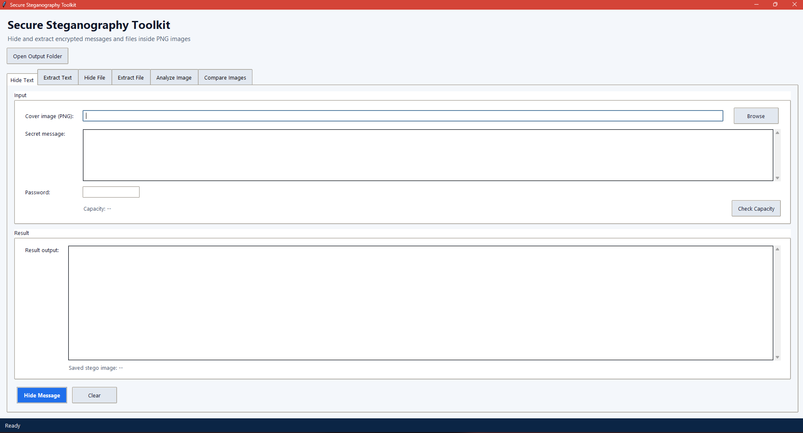
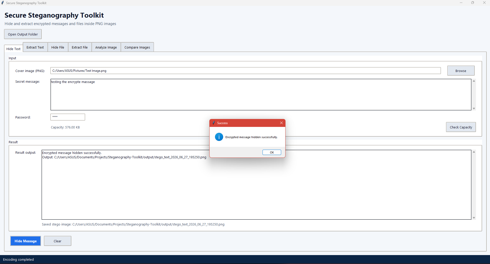
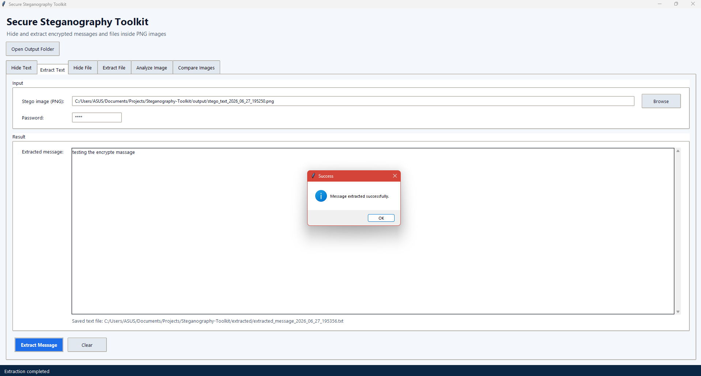
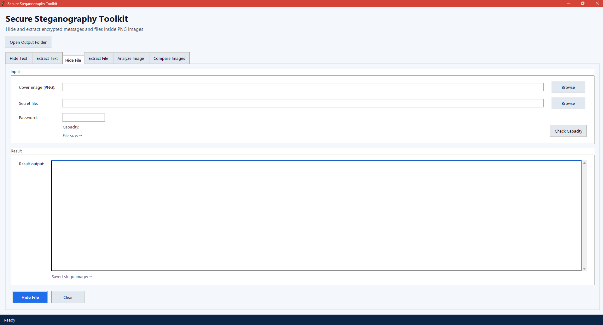
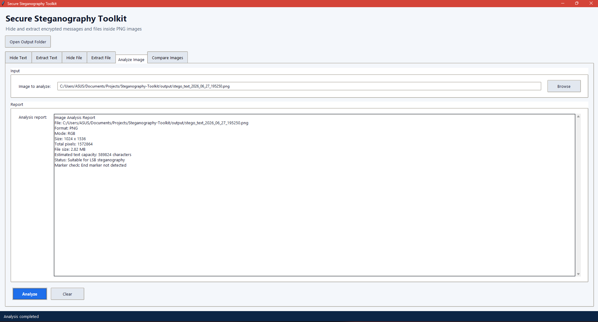
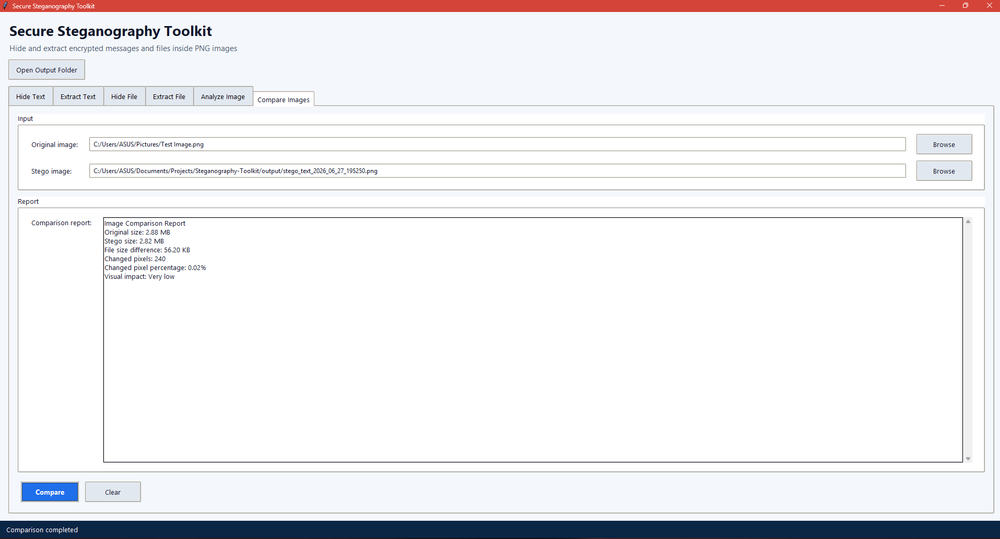

# Secure Steganography Toolkit

A Python desktop and command-line toolkit for hiding password-encrypted text messages and files inside PNG images using Least Significant Bit (LSB) steganography.

**Tech Stack:** Python • Tkinter • Pillow • cryptography • Fernet • PBKDF2-HMAC-SHA256 • LSB Steganography • CLI + GUI

---

## Table of Contents

* [Project Overview](#project-overview)
* [Key Features](#key-features)
* [Screenshots](#screenshots)
* [How the Project Works](#how-the-project-works)
* [Technical Architecture](#technical-architecture)
* [Payload Structure](#payload-structure)
* [Security Explanation](#security-explanation)
* [Technologies Used](#technologies-used)
* [Project Folder Structure](#project-folder-structure)
* [Installation](#installation)
* [Running the Application](#running-the-application)
* [Usage Guide](#usage-guide)
* [Supported Formats](#supported-formats)
* [Example Workflow](#example-workflow)
* [GitHub Cleanup Notes](#github-cleanup-notes)
* [Limitations](#limitations)
* [Future Improvements](#future-improvements)
* [Troubleshooting](#troubleshooting)
* [Author](#author)
* [License](#license)

---

## Project Overview

**Secure Steganography Toolkit** is a Python-based application that allows users to hide and extract encrypted text messages and files inside PNG images.

The project combines:

* **Steganography** for hiding data inside images
* **Encryption** for protecting the hidden content
* **Image processing** for reading and modifying PNG images
* **File handling** for hiding and restoring files
* **CLI and GUI interfaces** for easier user interaction

Unlike basic steganography tools that hide plain text directly, this toolkit encrypts the message or file before embedding it into the image. This means the hidden data is protected even if someone discovers that the image contains embedded information.

---

## Key Features

### Text Steganography

* Hide encrypted text messages inside PNG images
* Extract hidden text messages using the correct password
* Save extracted text automatically into the `extracted/` folder

### File Steganography

* Hide encrypted files inside PNG images
* Extract hidden files from stego images
* Supports common file formats such as `.txt`, `.pdf`, `.json`, `.zip`, and `.csv`

### Security

* Password-based encryption
* Fernet symmetric encryption
* PBKDF2-HMAC-SHA256 key derivation
* Random salt for stronger password-based key generation
* Structured payload format with metadata and encrypted data

### Image Tools

* Analyze image format, dimensions, file size, and hiding capacity
* Compare original and stego images
* View pixel change statistics and visual impact information

### User Interfaces

* Menu-based Command Line Interface through `main.py`
* Tkinter-based Graphical User Interface through `gui/app.py`

### Output Handling

* Generated stego images are saved in the `output/` folder
* Extracted text and files are saved in the `extracted/` folder

---

## Screenshots

Add your real screenshots inside the `screenshots/` folder and update the links below.

### Main GUI



### Hide Text



### Extract Text



### Hide File



### Analyze Image



### Compare Images



---

## How the Project Works

The toolkit follows a secure steganography workflow:

1. The user selects a PNG cover image.
2. The user enters a secret text message or selects a file.
3. The user provides a password.
4. The message or file is encrypted using a password-derived key.
5. A structured payload is created with metadata and encrypted data.
6. The payload is embedded into the least significant bits of the image’s RGB channels.
7. A new stego PNG image is saved in the `output/` folder.
8. During extraction, the hidden payload is decoded from the image.
9. The payload is decrypted using the correct password.
10. The extracted content is saved in the `extracted/` folder.

---

## Technical Architecture

| File / Folder       | Purpose                                                            |
| ------------------- | ------------------------------------------------------------------ |
| `main.py`           | CLI controller and menu system                                     |
| `gui/app.py`        | Tkinter graphical user interface                                   |
| `src/crypto.py`     | Encryption, decryption, and key derivation                         |
| `src/encoder.py`    | Payload encoding and LSB embedding                                 |
| `src/decoder.py`    | Payload extraction and LSB decoding                                |
| `src/file_stego.py` | Encrypted file hiding and extraction logic                         |
| `src/analyzer.py`   | Image analysis and capacity checking                               |
| `src/comparator.py` | Original image vs stego image comparison                           |
| `src/utils.py`      | Shared helpers, payload structure, paths, and capacity calculation |
| `test_images/`      | Safe sample images for testing                                     |
| `output/`           | Generated stego images                                             |
| `extracted/`        | Extracted messages and files                                       |
| `screenshots/`      | README screenshots                                                 |

---

## Payload Structure

Before embedding, the encrypted data is wrapped inside a structured binary payload. The embedded bitstream also includes a 4-byte length prefix so the decoder knows exactly how many bytes to read.

| Field            | Size     | Purpose                                                                      |
| ---------------- | -------- | ---------------------------------------------------------------------------- |
| Magic            | 4 bytes  | Identifies the payload using `"STEG"`                                        |
| Version          | 1 byte   | Payload format version                                                       |
| Payload Type     | 1 byte   | Identifies whether the payload is text or file data                          |
| Metadata Length  | 4 bytes  | Length of the metadata JSON                                                  |
| Encrypted Length | 4 bytes  | Length of the encrypted data                                                 |
| Metadata JSON    | Variable | Stores details such as encoding, original file name, extension, or file size |
| Encrypted Data   | Variable | Fernet-encrypted message or file bytes                                       |

This structured format makes extraction more reliable than using only a simple end-marker system.

---

## Security Explanation

This project uses both **steganography** and **encryption**.

* Steganography hides the existence of the data inside an image.
* Encryption protects the actual content of the hidden data.

Security methods used:

* The message or file is encrypted before embedding.
* The password is not stored directly.
* A key is derived from the password using PBKDF2-HMAC-SHA256.
* A random salt is used during key derivation.
* Fernet encryption provides authenticated encryption.
* If the wrong password is entered, decryption fails.
* If the hidden data is corrupted, extraction or decryption fails.

> This project is created for educational and ethical use only.

---

## Technologies Used

| Technology         | Purpose                                  |
| ------------------ | ---------------------------------------- |
| Python             | Main programming language                |
| Tkinter            | Desktop GUI development                  |
| Pillow             | Image processing                         |
| cryptography       | Encryption library                       |
| Fernet             | Symmetric authenticated encryption       |
| PBKDF2-HMAC-SHA256 | Password-based key derivation            |
| LSB Steganography  | Data hiding method                       |
| PNG                | Lossless image format used for embedding |

---

## Project Folder Structure

```text
Secure-Steganography-Toolkit/
├── gui/
│   └── app.py
├── src/
│   ├── analyzer.py
│   ├── comparator.py
│   ├── crypto.py
│   ├── decoder.py
│   ├── encoder.py
│   ├── file_stego.py
│   └── utils.py
├── test_images/
│   └── original.png
├── output/
│   └── .gitkeep
├── extracted/
│   └── .gitkeep
├── screenshots/
├── main.py
├── requirements.txt
├── README.md
└── .gitignore
```

> Note: The `output/` and `extracted/` folders should only contain `.gitkeep` in the GitHub repository. Generated stego images and extracted private files should not be committed.

---

## Installation

### 1. Clone the Repository

```bash
git clone https://github.com/your-username/Secure-Steganography-Toolkit.git
cd Secure-Steganography-Toolkit
```

Replace `your-username` with your actual GitHub username after creating the repository.

### 2. Create a Virtual Environment

```bash
python -m venv .venv
```

### 3. Activate the Virtual Environment

Windows PowerShell:

```powershell
.\.venv\Scripts\Activate.ps1
```

Windows Command Prompt:

```cmd
.venv\Scripts\activate.bat
```

macOS / Linux:

```bash
source .venv/bin/activate
```

### 4. Install Dependencies

```bash
python -m pip install -r requirements.txt
```

---

## Running the Application

### Run the CLI

```bash
python main.py
```

The CLI provides a numbered menu for all toolkit actions.

### Run the GUI Directly

```bash
python gui/app.py
```

### Launch GUI from CLI

You can also run:

```bash
python main.py
```

Then select:

```text
7. Launch GUI
```

---

## Usage Guide

## CLI Menu Options

```text
1. Hide encrypted text message in image
2. Extract encrypted text message from image
3. Hide encrypted file in image
4. Extract encrypted file from image
5. Analyze image
6. Compare original and stego image
7. Launch GUI
8. Exit
```

---

### Hide a Text Message

1. Run the application:

```bash
python main.py
```

2. Choose option `1`.
3. Select a PNG cover image.
4. Enter the secret message.
5. Enter a password.
6. The encrypted stego image will be saved in the `output/` folder.

---

### Extract a Text Message

1. Run the application:

```bash
python main.py
```

2. Choose option `2`.
3. Select the stego PNG image.
4. Enter the correct password.
5. The decrypted message will be displayed and saved in the `extracted/` folder.

---

### Hide a File

1. Run the application:

```bash
python main.py
```

2. Choose option `3`.
3. Select a PNG cover image.
4. Select a supported file.
5. Enter a password.
6. The encrypted stego image will be saved in the `output/` folder.

---

### Extract a File

1. Run the application:

```bash
python main.py
```

2. Choose option `4`.
3. Select the stego PNG image.
4. Enter the correct password.
5. The extracted file will be saved in the `extracted/` folder.

---

### Analyze an Image

1. Run the application:

```bash
python main.py
```

2. Choose option `5`.
3. Select a PNG image.
4. View details such as:

* Image format
* Image mode
* Dimensions
* File size
* Estimated hiding capacity

---

### Compare Original and Stego Images

1. Run the application:

```bash
python main.py
```

2. Choose option `6`.
3. Select the original image.
4. Select the stego image.
5. View comparison details such as:

* Original image size
* Stego image size
* Changed pixel count
* Changed pixel percentage
* Visual impact level

---

## Supported Formats

### Image Format

| Format | Status    | Notes                            |
| ------ | --------- | -------------------------------- |
| PNG    | Supported | Required because PNG is lossless |

### Hidden File Formats

| Extension | Status    | Notes               |
| --------- | --------- | ------------------- |
| `.txt`    | Supported | Plain text files    |
| `.pdf`    | Supported | PDF documents       |
| `.json`   | Supported | JSON data files     |
| `.zip`    | Supported | Compressed archives |
| `.csv`    | Supported | CSV tabular data    |

> The selected file must fit within the available image capacity.

---

## Example Workflow

Example text hiding workflow:

1. Use `test_images/original.png` as the cover image.
2. Enter a secret message.
3. Enter a password.
4. Save the stego image into `output/`.
5. Extract the message using the same password.
6. View the extracted message inside `extracted/`.

Example file hiding workflow:

1. Select a PNG cover image.
2. Select a supported file such as `.txt` or `.pdf`.
3. Enter a password.
4. Save the stego image into `output/`.
5. Extract the hidden file using the same password.
6. View the restored file inside `extracted/`.

---

## GitHub Cleanup Notes

The following files and folders should not be committed to GitHub:

```text
.venv/
venv/
env/
__pycache__/
*.pyc
output/*
extracted/*
*.log
*.tmp
```

Recommended `.gitignore` entries:

```gitignore
# Python cache
__pycache__/
*.py[cod]

# Virtual environments
.venv/
venv/
env/

# IDE files
.vscode/
.idea/

# OS files
.DS_Store
Thumbs.db

# Generated files
output/*
extracted/*

# Keep folder structure
!output/.gitkeep
!extracted/.gitkeep

# Temporary files
*.log
*.tmp
```

This keeps the repository clean while preserving the required folder structure.

---

## Limitations

* Only PNG images are supported for embedding.
* JPEG is not supported because lossy compression can damage hidden LSB data.
* Large files require large cover images.
* Editing, resizing, compressing, or converting a stego image may destroy hidden data.
* Encryption protects the content, but steganography does not guarantee that the hidden data is impossible to detect.
* This project is designed for educational use and is not a production-grade forensic tool.

---

## Future Improvements

Possible future improvements include:

* Improved GUI theme and layout
* Drag-and-drop file selection
* Progress bar for large file operations
* Password strength indicator
* Support for other lossless image formats such as BMP
* Batch processing for multiple images
* Optional restoration of the original file name during extraction
* More detailed steganalysis and anomaly detection
* Unit tests for encryption, encoding, decoding, and file extraction
* Exportable analysis and comparison reports

---

## Troubleshooting

### ModuleNotFoundError

Install the required dependencies:

```bash
python -m pip install -r requirements.txt
```

### PowerShell Virtual Environment Activation Error

If PowerShell blocks activation, run:

```powershell
Set-ExecutionPolicy -Scope CurrentUser RemoteSigned
```

Then activate again:

```powershell
.\.venv\Scripts\Activate.ps1
```

### Wrong Password

If the wrong password is entered, extraction will fail because the encrypted content cannot be decrypted.

### File Too Large

If the selected file is too large, use a larger PNG image with more available capacity.

### GUI Not Launching

Make sure Python and Tkinter are installed correctly. You can also launch the GUI through the CLI:

```bash
python main.py
```

Then select option `7`.

### Output or Extracted Folder Missing

Create the folders manually if needed:

```bash
mkdir output extracted
```

The application may also create these folders automatically during normal use.

---

## Author

**Nadeesha Jayasundara**

---

